 

### Hi, I'm Dustin 👋

I'm a developer and engineer building **GENSLATE**: fast, lightweight, strictly portable software with a calm, flat design language, and the AI tooling that makes it smarter.

- 🧊 Building [**GENSLATE SLATESUITE**](https://github.com/GENSLATE/GENSLATE-SLATESUITE), a family of portable desktop apps on one unified Nord design system
- 🦀 Most at home in **Rust**, **TypeScript** and **Tauri**, from native cores to pixel-precise UI
- 🤖 Exploring practical **AI** in everyday tools: assistants, code intelligence and automation
- 🏔️ Based in Ketchum, Idaho, and open to collaboration

### 🧰 Stack

  
   
  

### 🚀 Featured

<table>
  <tr>
    <td width="50%" valign="top">
      <h4><a href="https://github.com/GENSLATE/GENSLATE-SLATESUITE">GENSLATE SLATESUITE</a></h4>
      
A suite of fast, portable desktop apps (editor, terminal, browser, AI studio, explorer and more) sharing one Nord design system, custom window chrome and typed IPC.

      

        
        
        
        
      

    </td>
    <td width="50%" valign="top">
      <h4><a href="https://genslate.github.io">genslate.github.io</a></h4>
      
My developer profile site: a flat, fast, single-page site with an interactive particle field that reacts to your cursor. No frameworks, no build step.

      

        
        
        
      

    </td>
  </tr>
</table>

### 📊 GitHub

  
  

  

<picture>
  <source media="(prefers-color-scheme: dark)" srcset="https://raw.githubusercontent.com/GENSLATE/GENSLATE/output/github-snake-dark.svg" />
  <source media="(prefers-color-scheme: light)" srcset="https://raw.githubusercontent.com/GENSLATE/GENSLATE/output/github-snake.svg" />
  
</picture>

### 📫 Connect

  
  
  
  <!-- Fill in and uncomment once the handles are final.
  
  
  
  
  -->

  Built with care in the mountains of Idaho · <a href="https://genslate.github.io">genslate.github.io</a>

